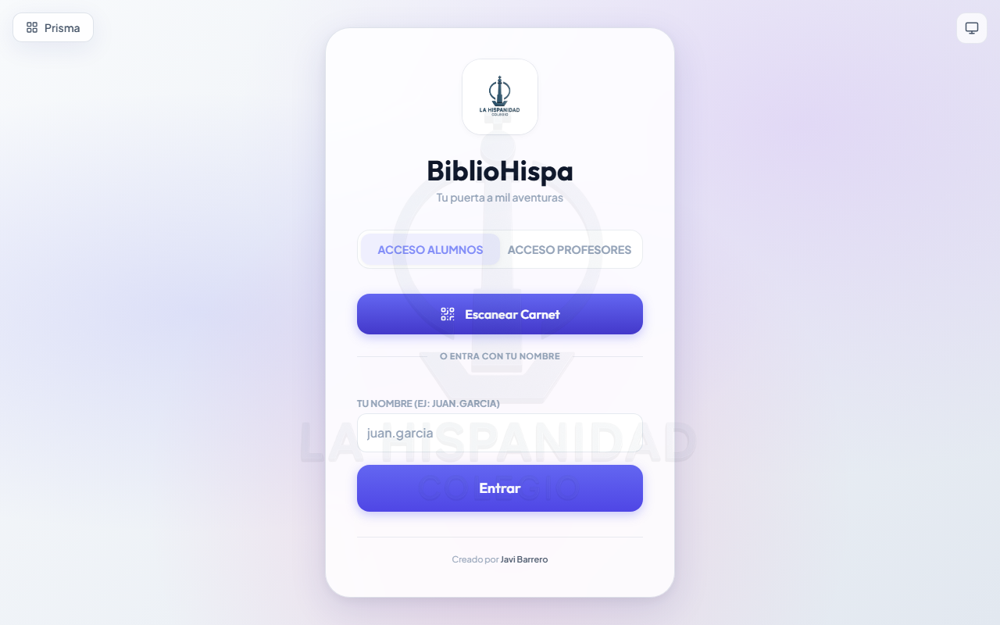
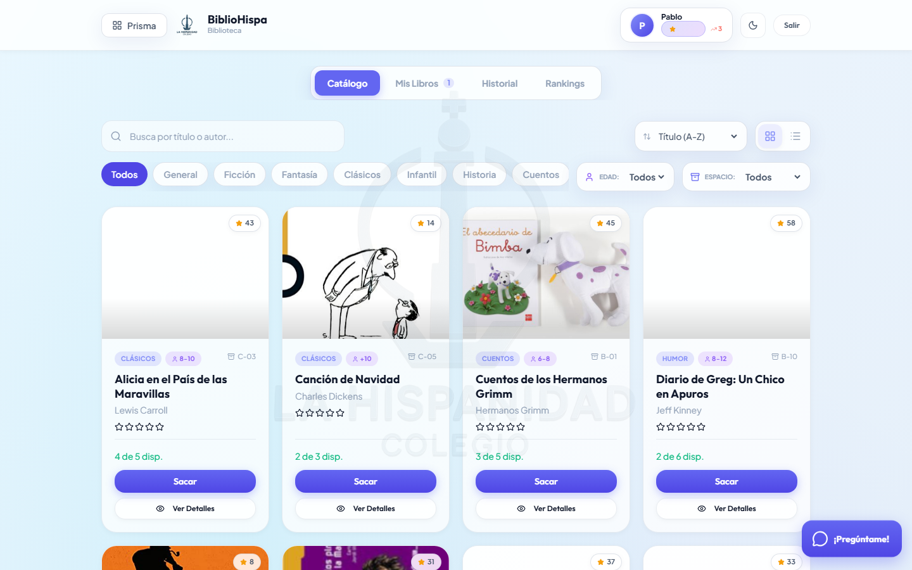
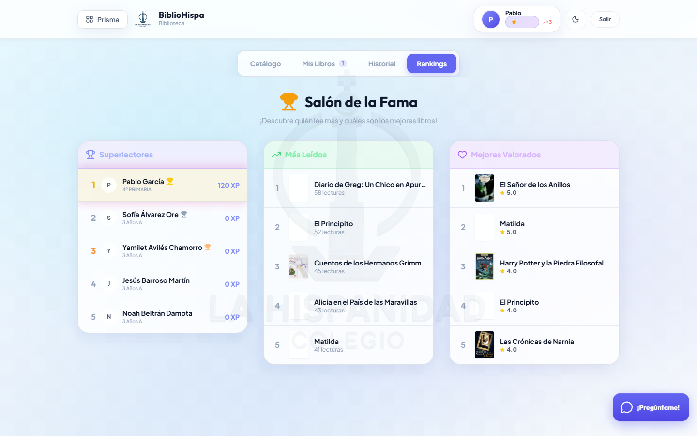
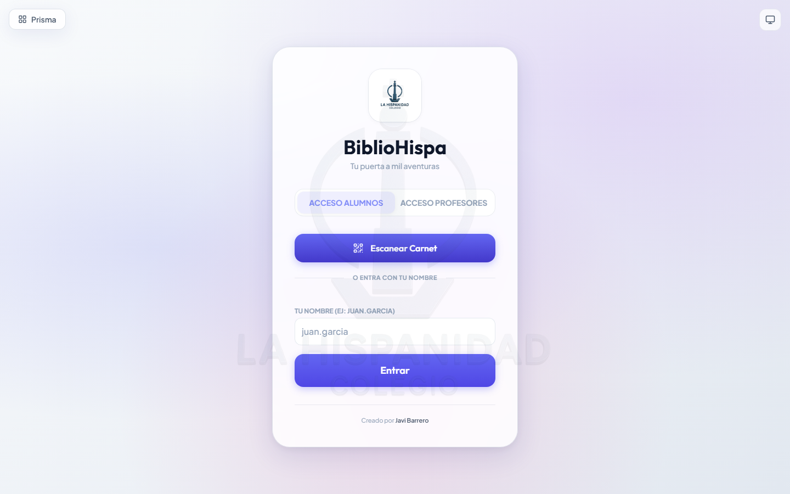
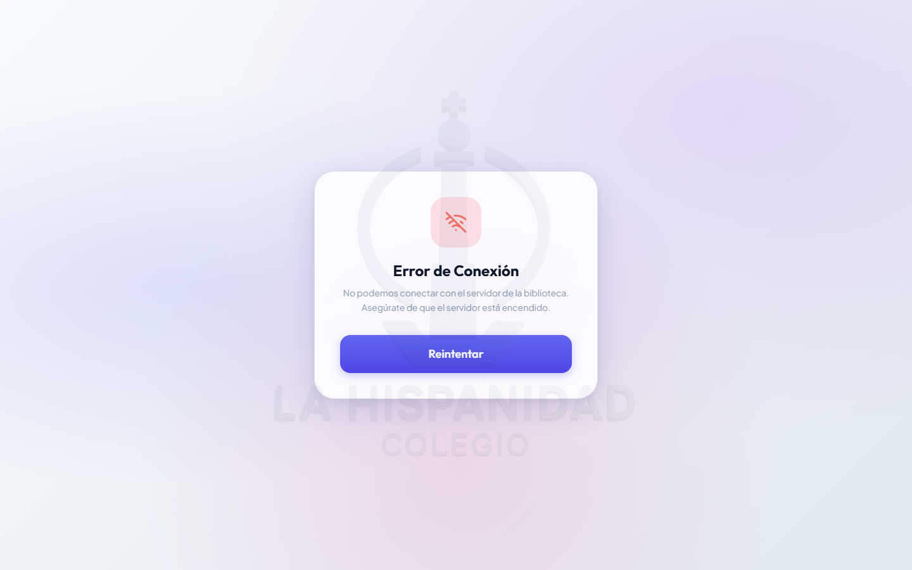

# BiblioHispa — Gestión de Biblioteca Escolar con IA

Sistema de gestión de la biblioteca del Colegio La Hispanidad. Combina préstamo de libros, gamificación para fomentar la lectura, asistente de IA integrado (Google Gemini) y generación de informes en PDF. Forma parte de la Suite Educativa La Hispanidad.

> **Acceso:** Alumnado y profesorado. Los alumnos acceden con QR o PIN; el profesorado con Google OAuth o SSO compartido con PrismaEdu.

---

## 📸 Capturas de Pantalla

| Login | Alumno — Catálogo de Libros |
|:---:|:---:|
|  |  |

| Alumno — Ranking y Gamificación | Admin — Gestión del Catálogo |
|:---:|:---:|
|  |  |

| Admin — Estadísticas y Clasificación | |
|:---:|:---:|
|  | |

---

## 🚀 Funcionalidades por Público

### 🎓 Alumnado

- **Catálogo de libros**
  - Explorar todo el fondo bibliográfico con portadas en alta calidad
  - Filtrar por género, edad recomendada y estantería
  - Buscar por título o autor
  - Ordenar por título, autor, popularidad (veces leído) o valoración media
  - Alternar vista en cuadrícula o lista
  - Ver ficha completa del libro: ISBN, páginas, editorial, fecha de publicación, descripción y valoraciones

- **Préstamos**
  - Ver libros actualmente en préstamo con fecha de devolución
  - Plazo estándar de préstamo: 15 días
  - Devolver libros (activa la gamificación)
  - Indicador de devolución anticipada
  - Notificación de fecha límite

- **Reseñas**
  - Valorar libros de 1 a 5 estrellas
  - Escribir comentario de texto libre
  - Ganar puntos al publicar una reseña
  - Desbloquear insignia "Crítico" al alcanzar el hito de 10 reseñas

- **BiblioBot (asistente IA)**
  - Chat flotante con el asistente inteligente (Google Gemini)
  - Recomendaciones personalizadas por género, edad o interés
  - Responde preguntas sobre el fondo bibliográfico
  - Conversación multi-turno en lenguaje natural

- **Gamificación y ranking**
  - Tabla de clasificación por puntos y libros leídos (global y por clase)
  - Racha de días consecutivos con actividad lectora
  - Galería de insignias desbloqueadas con descripción
  - Historial completo de préstamos y puntos ganados

- **Perfil personal**
  - Puntos acumulados, número de libros leídos, insignias, racha actual
  - Ver todas las reseñas propias

**Sistema de puntos:**

| Acción | Puntos |
|--------|--------|
| Tomar un libro prestado | +5 |
| Devolver a tiempo | +2 |
| Devolver con retraso | −1 por día |
| Publicar una reseña | +3 |
| Reseña de 5 estrellas | +2 adicionales |

**Insignias desbloqueables:** Novato · Lector Asiduo · Crítico · Streak Master · Speedreader · Explorer · Bibliófilo

---

### 👨‍🏫 Profesorado

- Acceso completo al catálogo de libros
- Gestión de préstamos propios (mismo acceso que el alumnado)
- Consulta de estadísticas generales y ranking

---

### 🏫 Dirección / Administración (ADMIN / SUPERADMIN)

- **Gestión del catálogo**
  - Añadir libros individualmente o por importación masiva desde CSV
  - Búsqueda automática de portadas (Gemini + Google Books + Open Library + Librario)
  - Editar metadatos: título, autor, ISBN, estantería, unidades, género, edad recomendada
  - Actualizar o cambiar portada manualmente
  - Eliminar libros del catálogo

- **Gestión de usuarios**
  - Crear, editar y eliminar alumnos y docentes
  - Importación masiva por CSV con asignación de clase
  - Ajustes manuales de puntos con historial detallado
  - Eliminar entradas del historial de puntos

- **Gestión de préstamos y reseñas**
  - Ver todos los préstamos activos e históricos
  - Generar informes PDF de préstamos por alumno
  - Ver y eliminar reseñas inapropiadas

- **Estadísticas**
  - Clasificación global y por clase con filtros por métrica
  - Gráficos de distribución de puntos, mejores lectores y popularidad de géneros

- **Carnets escolares**
  - Imprimir carnets de alumno con nombre y código de barras
  - Impresión individual o por clase completa

- **Configuración del sistema**
  - Nombre del colegio y logotipo
  - Cambio de contraseña de administración
  - Tema visual (claro/oscuro/automático)

- **Copias de seguridad**
  - Descargar la base de datos completa (`db.json`)
  - Restaurar desde una copia de seguridad

---

## ⚙️ Características Técnicas

- **Frontend:** React 19 + TypeScript, Vite, Tailwind CSS
- **Backend:** Node.js/Express (ESM)
- **IA:** Google Gemini (`gemini-2.5-flash`) — identificación de libros, valoración de edad y chat
- **Portadas:** Pipeline multi-fuente: Librario → Open Library → Google Books, con caché local en `data/covers/`
- **PDF:** jsPDF + jspdf-autotable (client-side)
- **Autenticación:** Google OAuth + PIN (proxy a PrismaEdu) + SSO compartido (`BIBLIO_SSO_TOKEN`)
- **Base de datos:** Archivo JSON central (`data/db.json`) con copias de seguridad automáticas en `data/backups/`
- **Despliegue:** PM2 en Ubuntu/Debian

---

## 📚 Guía de Despliegue

Esta guía explica cómo instalar, desplegar y mantener la aplicación BiblioHispa en tu servidor Ubuntu.
La aplicación incluye un backend (Node.js/Express) y una base de datos local (`data/db.json`).

---

## 🔑 PASO 0: Conseguir la API Key de Google Gemini (Gratis)

Necesaria para las funciones de IA (recomendaciones, chat).

1.  Entra en **[Google AI Studio](https://aistudio.google.com/app/apikey)**.
2.  Inicia sesión y pulsa **"Create API key"**.
3.  Copia el código que empieza por `AIza...`. Lo necesitarás durante la instalación.

---

## 🚀 Instalación Automática (Recomendada)

Hemos incluido un script (`install.sh`) que automatiza todo el proceso: instalación de dependencias (Node.js, Nginx, PM2), configuración y despliegue.

### 1. Clonar el repositorio
Conéctate a tu servidor y clona el repositorio en la carpeta donde quieras instalarlo (o en una temporal).

```bash
# Clona el repositorio (sustituye la URL por la tuya si es un fork)
git clone https://github.com/TU_USUARIO/bibliohispa.git

# Entra en la carpeta descargada
cd bibliohispa
```

### 2. Ejecutar el script de instalación
Da permisos de ejecución y lanza el script. Este script puede ejecutarse de forma segura tanto para **instalaciones nuevas** como para **actualizaciones**.

```bash
chmod +x install.sh
./install.sh
```

**El script te guiará paso a paso:**
1.  **Configuración:** Te preguntará dónde instalar la aplicación (por defecto `/var/www`) y el nombre de la carpeta (por defecto `BiblioHispaApp`).
2.  **Dependencias:** Instalará automáticamente Node.js (v20), PM2, Nginx y otras herramientas necesarias si no están presentes.
3.  **Clonado/Actualización:**
    *   Si es una **instalación limpia**, clonará el repositorio en el directorio destino final.
    *   Si detecta que **ya existe**, actualizará el código (`git pull`) conservando tus datos.
4.  **Entorno:** Te pedirá la **API Key de Gemini** para generar el archivo `.env` automáticamente.
5.  **Despliegue:** Instalará las dependencias npm, compilará el frontend y lanzará el servidor con PM2.

---

## 🔄 Actualización

Para actualizar la aplicación cuando haya nuevas versiones, simplemente vuelve a ejecutar el script `install.sh` desde la carpeta del repositorio:

```bash
./install.sh
```

El script detectará la instalación existente, descargará los últimos cambios, reinstalará dependencias y reconstruirá la aplicación automáticamente.

---

## 🌐 Exponer a Internet (Nginx + Cloudflare)

Una vez instalada la aplicación (corriendo en `localhost:3000`), necesitas hacerla accesible desde fuera.

### Opción A: Usar Cloudflare Tunnel (Más Seguro y Fácil)
Recomendado para evitar abrir puertos en el router y obtener HTTPS automático.

1.  Instala `cloudflared` en tu servidor.
2.  En el panel Zero Trust de Cloudflare, crea un túnel y apúntalo a:
    *   **Service:** `HTTP` -> `localhost:3000`

### Opción B: Usar Nginx como Proxy Inverso
El script de instalación ya deja instalado Nginx. Configúralo así:

1.  Crea el archivo de configuración:
    ```bash
    sudo nano /etc/nginx/sites-available/bibliohispa
    ```

2.  Pega el siguiente contenido (ajusta `server_name` a tu dominio):
    ```nginx
    server {
        listen 80;
        server_name tu-dominio.com;

        location / {
            proxy_pass http://localhost:3000;
            proxy_http_version 1.1;
            proxy_set_header Upgrade $http_upgrade;
            proxy_set_header Connection 'upgrade';
            proxy_set_header Host $host;
            proxy_cache_bypass $http_upgrade;
        }
    }
    ```

3.  Activa el sitio y reinicia:
    ```bash
    sudo ln -s /etc/nginx/sites-available/bibliohispa /etc/nginx/sites-enabled/
    sudo systemctl restart nginx
    ```

---

## 🛠️ Mantenimiento y Seguridad

**Ver logs del servidor:**
```bash
pm2 logs biblioteca
```

**Copia de Seguridad:**
Tus datos están en `data/db.json`.
El sistema realiza backups automáticos diarios en `data/backups/`, pero te recomendamos descargar el archivo `db.json` regularmente desde el **Panel de Administración > Ajustes**.

**⚠️ IMPORTANTE: Cambiar Contraseña**
La aplicación se instala con el usuario `superadmin` y contraseña `admin123`.
**Cámbialo inmediatamente** entrando en el panel de administración tras la instalación.
